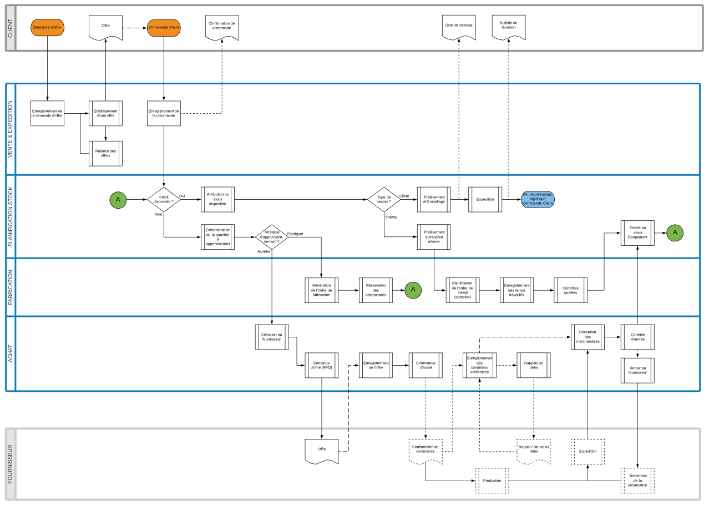

################################################
Le fonctionnement logistique du système Odoo V11
################################################

=====================================================
Le :index:`processus standard`
=====================================================

Le processus intégré depuis la vente
------------------------------------

:download:`Processus logistique et commercial standard (pdf)  <./media/Odoo11_Process_AS-IS.pdf>`  :download:`(png)  <./media/Odoo11_Process_AS-IS.png>`  :download:`(svg)  <./media/Odoo11_Process_AS-IS.svg>`

Démonstration
-----------------

:download:`Démonstration "Enregistrement d'une commande pour un vélo" <./media/odooV11e_demo_velos_mto_v01.pdf>`

=====================================================
La structure logistique
=====================================================

:index:`Entrepôt` (:index:`Warehouse`)
--------------------------------------------
Un entrepôt est le bâtiment où les articles sont stockés.

:index:`Emplacement de stock` (:index:`Stock Location`)
--------------------------------------------------------------

Un emplacement est un espace spécifique dans l'entrepôt. Il peut être considéré comme une sous-localisation de l'entrepôt, ça peut être une étagère, un plancher, une allée, etc... Par conséquent, un emplacement fait partie d'un seul entrepôt et il est impossible de relier un emplacement à plusieurs entrepôts. Il est configurer autant d'emplacements que souhaité dans un entrepôt.

Schéma des flux
---------------

Ce schéma décrit les emplacements de stock de stocks standards du système Odoo de base, avec leurs parents respectifs (Société, Entrepôt, Emplacement parent). Les routes entre ces emplacements sont également spécifiées.

Deux entrepôts de la même société peuvent échanger du stock en passant par une zone de transit, appartenant à la société, mais hors entrepôt. 

    .. figure:: ../img/routes_et_emplacements01_map_paysage.png
        :alt: Routes et Emplacements de stock
        :align: center

    :download:`Routes et Emplacements de stock (pdf) <./media/Odoo11_Routes_et_Emplacements_de_stock_V02.pdf>` :download:`(svg) <./media/Odoo11_Routes_et_Emplacements_de_stock_V02.svg>`

:Emplacement fournisseur: Un emplacement virtuel qui correspond à l'emplacement d'origine des produits issus de vos fournisseurs.
:Vue: Emplacement virtuel utilisé pour créer des structures hiérarchiques pour votre entrepôt, en agrégeant ses emplacements enfants ; ne peut pas directement contenir de produits.
:Emplacement interne: L'emplacement physique dans votre entrepôt.
:Emplacement client: Un emplacement virtuel qui correspond à l'emplacement de destination des produits envoyés à vos clients.
:Perte de stock: Emplacement virtuel servant de contre-valeur aux opérations d'inventaire utilisées pour corriger les niveaux de stock (inventaires physiques).
:Approvisionnement: Emplacement virtuel servant de contre-valeur temporaire pour les opérations d'approvisionnement lorsque la source (fournisseur ou fabrication) n'est pas encore connue. Normalement, cet emplacement est vide une fois que le planificateur d'approvisionnement a fini de s'exécuter.
:Fabrication: Emplacement virtuel de contre-valeur pour les opérations de fabrication. Cet emplacement consomme des matières premières et fabrique des produits finis.
:Emplacement de transit: emplacement physique de contre-valeur à utiliser pour les opérations inter-entreprises et inter-entrepôts.

=====================================================
Les flux internes et externes
=====================================================

Ce schéma représente une vue détaillée des :index:`flux opérationnels` internes et externes, y compris achats, inter-entrepôts et production. Les :index:`points de contrôle` (QC) ainsi que les tests associés sont indiqués.

    .. figure:: ../img/routes_et_qualite01.png
        :scale: 70%
        :alt: Routes et Qualite
        :align: center

    :download:`Routes et Qualité (pdf) <./media/Odoo11_Qualite_et_routes_V01.pdf>` :download:`(svg) <./media/Odoo11_Qualite_et_routes_V01.svg>`

================================
Les routes et les règles
================================

Les routes
---------------------------------

Sous Odoo, une :index:`route` représente en ensemble de :index:`règles d'approvisionnement` (:index:`Procurement Rules`) et de :index:`règles de flux poussés` (:index:`Push Rules`).

Des routes peuvent être associées à un produit par :

    - association directe (ficher produit)
    - association par la catégorie du produit
    - dans le poste de la commande client

Ce schéma représente une vue des emplacements de stock et routes/règles pour un flux transverse "Commande client" vers "Achat" et retour. Il décrit les différentes étapes pour la réalisation du besoin du client.

    .. figure:: ../img/WH_Fonctionnement_des_Routes.png
        :alt: Fonctionnement des routes
        :align: center

    :download:`Fonctionnement des routes (pdf) <./media/WH_Fonctionnement_des_Routes.pdf>` :download:`(svg) <./media/WH_Fonctionnement_des_Routes.svg>`

Les règles
-------------------------

Les règles sont définies au niveau des routes. Il en existe deux types :

    #. Règles d'approvisionnement (Procurement Rules)
        Ce type de règle crée un besoin (move_lines) entre l'emplacement de stock "demandeur" (à l'origine du besoin - :index:`Emplacement d'origine`) et un emplacement "fournisseur" (qui comblera le besoin :index:`Emplacement d'approvisionnement`). 
        Lorsque l'emplacement "fournisseur" obtient du stock pour ce besoin, il le "pousse" vers son origine.

    #. Règles de flux poussés (Push Rules)
        Ce type de règle permet de pousser du stock d'un emplacement à un autre, sans besoin préalable. Il peut être automatique ou nécessité une action manuelle.

La méthode d'approvisionnement
~~~~~~~~~~~~~~~~~~~~~~~~~~~~~~~~~~~~~~~~~~

La :index:`méthode d'approvisionnement` défini si une règle :

    - "cascade" son besoin automatiquement en amont (:index:`Créer un approvisionnement`) à une règle ayant un emplacement d'origine identique à son emplacement d'approvisionnement (MTO), ou 
    - puise dans le stock de l'emplacement d'approvisionnement (:index:`Prendre du stock` - MTS). 

Séquence de détermination de la route et de la règle applicable
------------------------------------------------------------------------------

La route sélectionnée et l'emplacement du besoin détermineront les règles applicables. Il peut toutefois arriver que des routes et règles soient en concurrence pour le même binôme "Emplacement demandeur" et "Emplacement fournisseur". Dans ce cas, c'est la règle avec le No de séquence le plus petit qui sera sélectionnée.

Le schéma ci-dessous décrit cette séquence :

    .. figure:: ../img/WH_Routes_Procurement_Rule_Determination.png
        :alt: Determination de la règle applicable
        :align: center

    :download:`Séquence de détermination de la règle application (pdf) <./media/WH_Routes_Procurement_Rule_Determination.pdf>` :download:`(svg) <./media/WH_Routes_Procurement_Rule_Determination.svg>`

================================================
La fabrication
================================================

Sous Odoo et dans sa version la plus simple, la fabrication est matérialisée par des documents de type MO (:index:`Manufacturing Order`). Ces documents permettent principalement de réserver les composants dans les quantités nécessaires pour la réalisation du produit transformé.

Ces :index:`ordres de fabrication` peuvent être créées manuellement, mais dans la majorité des cas, ils seront générés automatiquement par un besoin posé sur un produit associé avec la route "Manufacture" et une :index:`nomenclature`.

Si la saisie des temps et le routage entre départements sont nécessaires, on créera en plus au préalable des :index:`gammes opératoires` détaillant la :index:`séquence des opérations`, et pour chaque :index:`opération`, les composants à associer et le :index:`poste de travail` concerné.

Associée à la nomenclature du produit à fabriquer/assembler, la gamme opératoire permettra d'établir des ordres de travail en relation avec un ordre de fabrication et notamment de timbrer les temps de réalisation.

En version Entreprise, des documents multimédia (instruction de montage, dessins techniques, etc. ) pourront être associés aux opérations, et des points de contrôle pourront être définis afin de vérifier que les opérations ont bien été réalisées conformément aux spécifications (Module QC).
